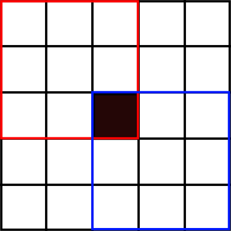

# [AtCoder ABC 045 D すぬけ君の塗り絵/Snuke's Coloring](https://beta.atcoder.jp/contests/abc045/tasks/arc061_b)

:::tip 問題
縦$H$, 横$W$の白いマス目のうち$N$個を黒く塗りつぶす。以下のものの個数を各$j$に対し計算する。
- 各整数$j(0 \leq j \leq 9 )$について、盤に含まれる$3$行$3$列の連続するマス目のうち、黒いマスがちょうど$j$個あるもの。
:::

- __方針__
- まず$H$, $W$が$10^9$なのがやばい。普通に$3$行$3$列を全探索しても終わらないことが分かる。
- 次に、黒いマス目は高々$10^5$個なので、ここに対してアプローチしたいと思う。
- 二つの方針が思いつく。
    - 座圧する→白の領域が広いので、白の領域を縮めることはできないか？→$3$行$3$列のマス目がつぶされてしまうので難しい。
    - 黒のマス目の周辺を探索する$(i)$
- 今回は$(i)$の方針を考える。(一次元で試して思いついたので、二次元で詰まったら次元を落としてみる)




- 上のように、黒のマスが影響を及ぼすのは周辺$5$行$5$列なので、$3$行$3$マスの左上に着目して高々$9N$個に対して探索すればよいとわかる。
- ここで$3$行$3$列のマス目と左上の点は一対一に対応しているので、mapで左上の点を数えていくと、$3$行$3$列のマス目の中に黒いマス目がいくつあるのかをカウントできる。(各黒マスを一回数えるごとに、map[座標]の値が一つずつ増えていく)
- 以上をコードにする。計算量は$9N$でmapを使っているので$O(N)$か？

```cpp
#include <bits/stdc++.h>
using namespace std;

int64_t a,b,H,W;
int64_t cnt[10];
map<pair<int64_t, int64_t>, int64_t> mp;
int N,i,j,k;
int64_t sm;
int main(){
  std::ios::sync_with_stdio(false);
  std::cin.tie(0);

  // ifstream in("input.txt");
  // cin.rdbuf(in.rdbuf());

  cin>>H>>W>>N;
  for(i=0;i<N;i++){
    cin>>a>>b;
    a--;b--;
    for(j=-2;j<=0;j++){
      for(k=-2;k<=0;k++){
        if(a+j<0 || a+j+2>H-1 || b+k<0 || b+k+2>W-1)continue;
        mp[make_pair(a+j, b+k)]++;
      }
    }
  }
  sm = (H - 2) * (W - 2);
  for(auto itr=mp.begin(); itr!=mp.end();++itr){
    for(i=1;i<=9;i++){
      if((itr->second)==i)cnt[i]++;
    }
  }
  for(i=1;i<=9;i++){
    sm-=cnt[i];
  }
  cnt[0]=sm;
  for(i=0;i<=9;i++)cout << cnt[i] << endl;
  return 0;
}
```
::: warning まとめ
- 典型: 正方形グリッドを見るときは左上の点と一対一対応させる。
- 1-indexedと0-indexedに気を付ける
- $10^9$が入るときはmapに持たせることを考える。(配列には持てないため)
:::